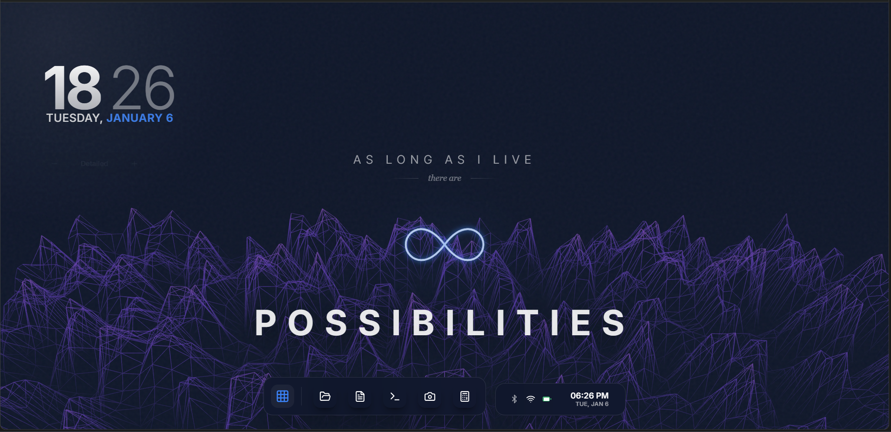
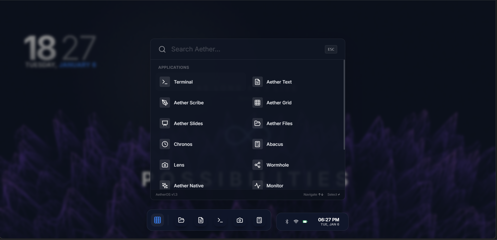
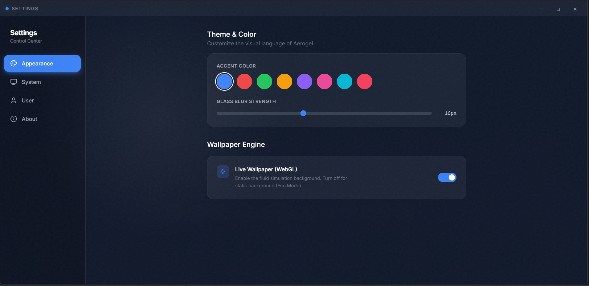

<div align="center">
    
    <br/>
    <br/>

# AetherOS
### Weightless Computing for the Web

[](https://react.dev/)
[](https://www.typescriptlang.org/)
[](https://vitejs.dev/)
[](https://threejs.org/)
[](https://www.framer.com/motion/)

<p align="center">
  <b>AetherOS</b> is a next-generation web interface that redefines the browser as a spatial operating system.<br/>
  It combines fluid physics, 3D atmospherics, and local intelligence to create a workspace that feels alive.
</p>

</div>

---

## 🌌 The Vision

The web has evolved, but our interfaces often remain static. **AetherOS** breaks the mold by treating the browser tab as a full-fledged runtime environment. It’s not just a collection of components—it's a cohesive digital space where applications float, snap, and interact with tactile precision.

This project is an exploration of **"OS-in-browser"** architecture, demonstrating how modern web technologies can replicate—and even exceed—the feel of native desktop environments.

---

## 💎 Features & capabilities

### 🖥️ Spatial Desktop Environment
- **Window Management**: A robust windowing system with z-index stacking, minimization states, and drag-and-snap mechanics.
- **Global File System**: A virtual FS implementation that persists data across sessions using IndexedDB/LocalStorage.
- **Task Management**: A responsive dock and system tray that handle process switching and background tasks.

### 🎨 Visual & Motion Engine
- **Fluid Physics**: Every interaction—opening an app, dragging a window, hovering icons—is driven by spring physics (via Framer Motion) rather than linear CSS transitions.
- **3D Integration**: The desktop background is a live 3D scene (React Three Fiber) that reacts to cursor movement and system themes.
- **Glassmorphism System**: A dynamic theming engine that handles blurs, transparency, and light/dark modes systematically.

### 🛠️ Built-in Ecosystem
A suite of native-feeling applications designed to showcase different architectural patterns:
- **Cortex**: An intelligent assistant interface for natural language tasks.
- **Scribe**: A block-based rich text editor for distraction-free writing.
- **Lens**: A high-performance media viewer with zoom and pan capabilities.
- **Terminal**: A functional command-line emulator with a custom parser.
- **System Control**: A comprehensive settings panel for deep OS configuration.

---

## 🧠 Engineering Architecture

AetherOS is built on a "Kernel-Shell-App" architecture pattern to separate concerns and ensure scalability.

### 1. The Kernel (State & Logic)
The core logic resides in decoupled **Zustand** stores:
- `useWindowManager`: Orchestrates process lifecycles and window states.
- `useFileSystem`: Manages the virtual file tree and read/write operations.
- `useTheme`: Controls the global design system tokens.

### 2. The Shell (Visuals)
The presentation layer creates the "OS Illusion" using modular primitives:
- **WindowFrame HOC**: Wraps any standard React component to give it OS superpowers (header bars, resize handles).
- **Portal Manager**: Handles overlays, context menus, and notifications outside the DOM hierarchy of windows.

### 3. The App Registry
Applications are lazy-loaded modules. The `AppRegistry` maps unique Bundle IDs to their imports, ensuring the initial load is lightweight.

---

## 📸 Gallery

| **App Launcher** | **File Explorer** |
|:---:|:---:|
|  |  |

<details>
<summary><b>View More Screenshots</b></summary>
<br/>

**Settings Panel**


**Camera Application**


</details>

---

## ⚡ Quick Start

Boot up AetherOS on your local machine.

**Prerequisites:** Node.js v18+

```bash
# 1. Clone the repository
git clone https://github.com/sharmaram25/AetherOS.git

# 2. Navigate to project root
cd AetherOS

# 3. Install dependencies
npm install

# 4. Start the OS
npm run dev
```

Visit `http://localhost:3000` to enter the environment.

---

## 👨‍💻 Creator

<div align="left">
  
**Ram Sharma**  
*B.Tech CSE Graduate ⋅ Creative Technologist*

> *"Working to solve problems one code at a time."*

I build digital experiences that operate at the intersection of rigorous engineering and creative design. AetherOS is my sandbox for testing the limits of what the web can do.

**Connect & Explore:**
- [GitHub Profile](https://github.com/sharmaram25)
</div>

---

<p align="center">
  <i>Part of the Ongoing Work series. © 2024 Ram Sharma.</i>
</p>

