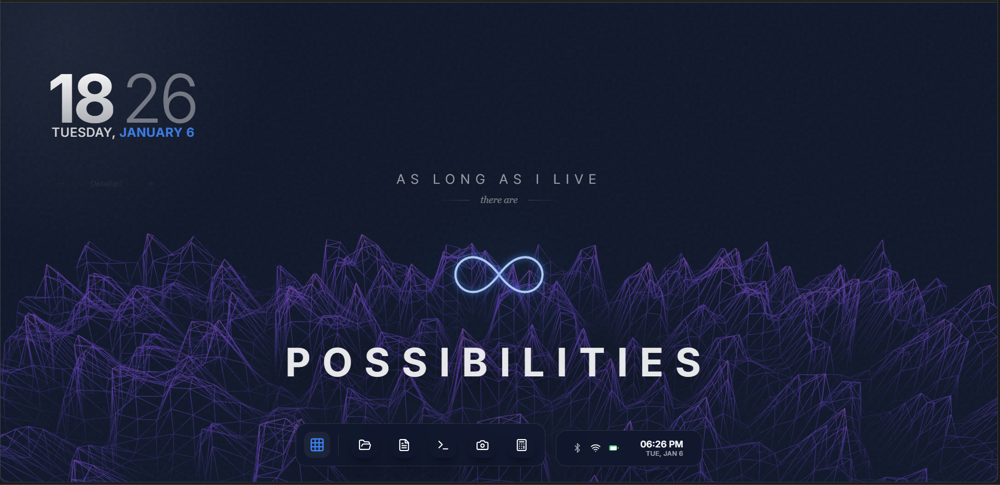

<div align="center">

# AetherOS
### Weightless Computing for the Web



<br/>

[](https://react.dev/)
[](https://www.typescriptlang.org/)
[](https://vitejs.dev/)
[](https://threejs.org/)
[](https://www.framer.com/motion/)
[](https://zustand.docs.pmnd.rs/)
[](#quick-start)
[](#license)

</div>

---

## ✨ What is AetherOS?

AetherOS is a browser-native WebOS that turns a tab into a full desktop-like runtime.
It blends immersive visuals, persistent state, and practical built-in apps into a cohesive operating experience.

This is not a static dashboard. It is an **OS-style interaction model** with process-like windows, app lifecycle behavior, shell surfaces, and storage-backed workflows.

---

## 🚀 Why It Stands Out

- **Real windowing model**: draggable windows, focus stack, minimize/maximize, restore, and docking interactions.
- **Persistent virtual filesystem**: app data survives sessions with worker-backed storage behavior.
- **Living shell**: glass UI + spatial/3D background + adaptive rendering quality.
- **App-native workflows**: editors, terminal, monitor, camera, time suite, AI assistant, file explorer.
- **Production-grade UX decisions**: explicit enter/exit routes for mode-heavy experiences, safe fallback paths, and resilient overlays.

---

## 🧩 Feature Showcase

### 🖥️ WebOS Shell
- Dock with active process indicators and launch controls.
- Nexus launcher for app + file discovery.
- Context menus and notification center.
- System tray with live device/context signals.

### 🌌 Visual + Motion System
- 3D wallpaper via React Three Fiber.
- Shared motion primitives for interaction consistency.
- Eco mode + reduced-motion aware behavior.
- Accent-based theming and glass depth system.

### 🗂️ Data + Runtime
- Zustand-powered state kernel.
- IndexedDB/worker-backed filesystem model.
- Recursive-safe delete and parent path materialization.
- Lazy app loading for startup responsiveness.

---

## 🛠️ Tech Stack

| Layer | Technology |
|---|---|
| UI Runtime | React 18, TypeScript |
| Build System | Vite |
| Motion | Framer Motion |
| 3D | Three.js, @react-three/fiber, @react-three/drei |
| Charts | Recharts |
| State | Zustand |
| Storage | IndexedDB + LocalStorage + Worker bridge |
| AI Runtime | @mlc-ai/web-llm (with safe-mode fallback) |

---

## 📱 App Suite (Current)

### Productivity
- **Aether Text** — markdown-friendly writing, open/new/save/save-as workflows.
- **Aether Scribe** — focus writing, formatting tools, export behavior, mode exit controls.
- **Aether Grid** — virtualized sheet model, formulas, and file lifecycle actions.
- **Aether Files** — searchable filesystem explorer with sorting, breadcrumbs, create/delete.

### Utility + System
- **Terminal** — command shell + sandboxed JS REPL + app/file bridge commands.
- **System Monitor** — CPU/memory telemetry simulation + process metrics + uptime/FPS cards.
- **Chronos** — clock, stopwatch, timer, and alarm utilities.
- **Settings** — appearance, performance, motion, and storage controls.

### Intelligence + Media
- **Cortex AI** — local AI assistant surface with app/file tool interactions.
- **Lens** — camera app with filter pipeline, capture flow, and mirror correction.
- **Wormhole / Image Filter / Abacus / Epoch** — specialized utility applications.

> Note: **Aether Slides** has been removed from the suite.

---

## 🧠 Architecture Overview

### 1) Kernel Layer (State + Persistence)
- `store/useWindowManager.ts`
- `store/useFileSystem.ts`
- `stores/settingsStore.ts`

### 2) Shell Layer (OS Surfaces)
- `components/os/WindowManager.tsx`
- `components/os/WindowFrame.tsx`
- `components/os/Dock.tsx`
- `components/os/Nexus.tsx`
- `components/os/SystemTray.tsx`
- `components/os/ContextMenu.tsx`
- `components/os/NotificationCenter.tsx`

### 3) Experience Layer (3D + Theme)
- `components/3d/WallpaperEngine.tsx`
- `components/3d/DesktopWidgets.tsx`
- `hooks/useTheme.ts`
- `utils/MotionConfig.ts`

### 4) App Registry Layer
- `utils/appRegistry.tsx`

---

## ⚡ Quick Start

### Prerequisites
- Node.js 18+
- npm 9+

### Run Locally

```bash
npm install
npm run dev
```

### Production Build

```bash
npm run build
npm run preview
```

---

## 📁 Project Structure

```text
components/
  3d/              # Wallpaper + spatial visuals
  apps/            # App modules
  os/              # Shell, launcher, tray, windowing surfaces
store/             # Core stores (filesystem, window manager)
stores/            # Settings store
services/          # Service layer (e.g., Cortex)
utils/             # Registry, backup, security, motion config
workers/           # Worker runtime for persistence/compute
```

---

## 🧭 Roadmap

- Stronger multi-document workflows in editor apps
- Richer process/session recovery behavior
- More robust app permission and capability boundaries
- Better chunking for very heavy modules (AI/3D)
- Additional production hardening and diagnostics surfaces

---

## 👨‍💻 Author

**Ram Sharma**  
Creative Technologist · Full-Stack Builder · Systems UI Enthusiast

> "Working to solve problems one code commit at a time."

AetherOS is part product exploration, part engineering lab, and part design statement for web-native operating environments.

### Connect
- GitHub: [https://github.com/sharmaram25](https://github.com/sharmaram25)
- Portfolio: [https://portfolio-ram-sharma.netlify.app/](https://portfolio-ram-sharma.netlify.app/)

---

## 📜 License

MIT
